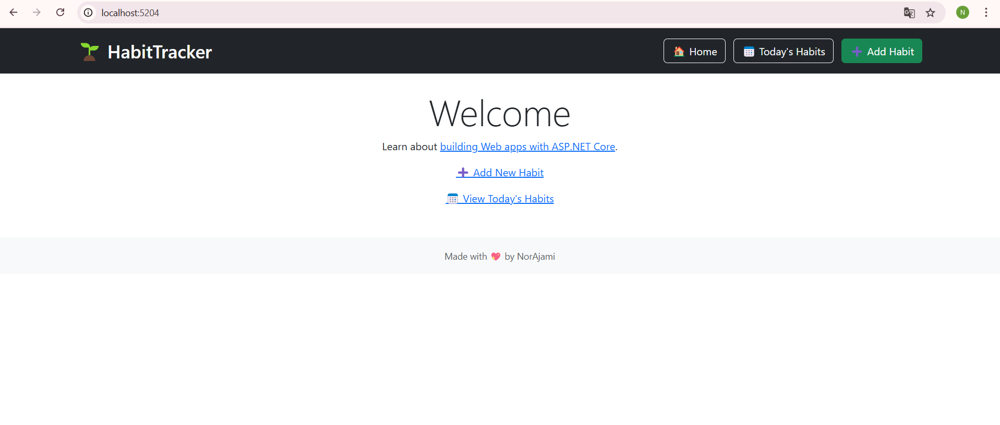
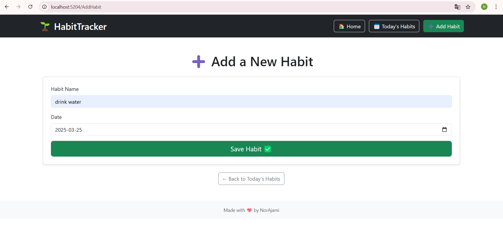
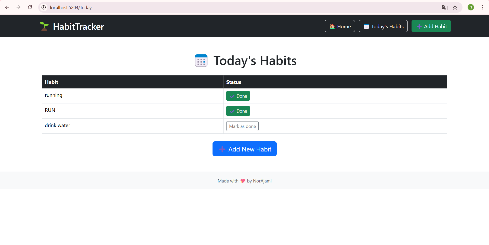
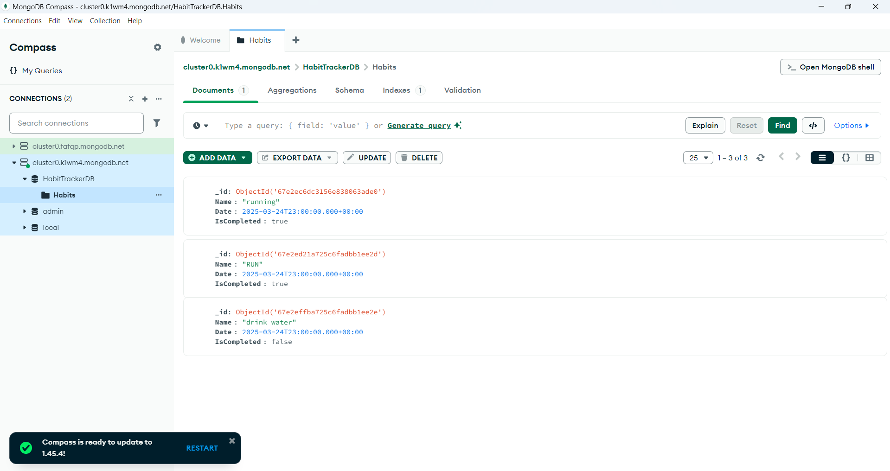
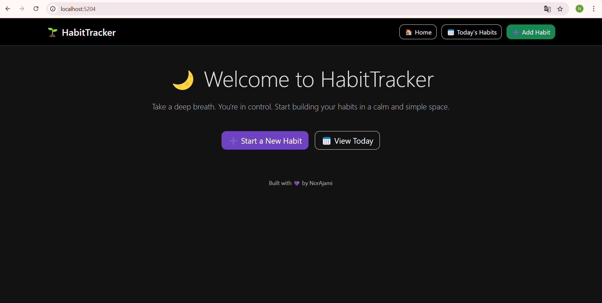
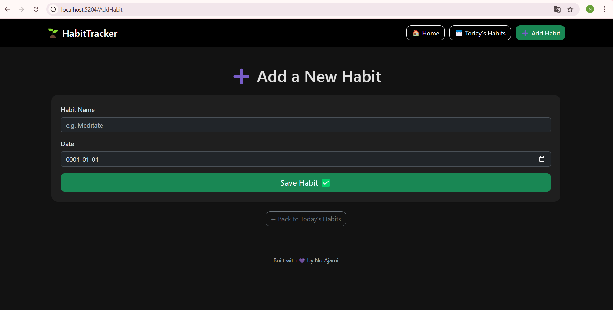
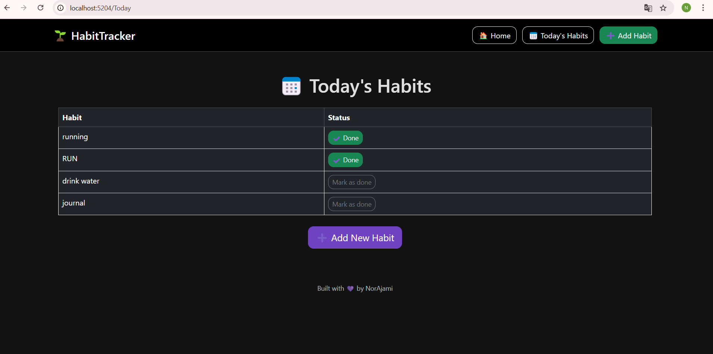

# 🌱 HabitTracker

A beginner-friendly **Habit Tracker** built with ASP.NET Core Razor Pages and **MongoDB Atlas**.
You can:

✅ Add new habits  
📅 View today's habits  
✅ Mark them as completed  
☁️ All data is saved in the cloud using MongoDB

___

## 🚀 Features

- ASP.NET Core Razor Pages (.NET 8)
- MongoDB Atlas integration
- Bootstrap 5 styling
- Async methods and clean architecture
- Dependency Injection

___

## 📸 Screenshots

### Welcome - Home Page



### Add a new habit



### View today's habits



### MongoDB Compass



## Play around with the index and Layout to make it more of your stile!






---


## 🛠️ Tech Stack

- ASP.NET Core Razor Pages
- C#
- .NET 8
- VS Code

## 🧪 Future Improvements

- Visual statistics (progress bar / charts)
- User login with Identity
- Docker + Azure deployment
- Responsive design

## 🧰 How to Run Locally

```bash
git clone https://github.com/NorAjami/HabitTracker.git
cd HabitTracker
dotnet run
```

Then open your browser at http://localhost:5000

 Made with love by a student who is learning by doing 🧑‍💻